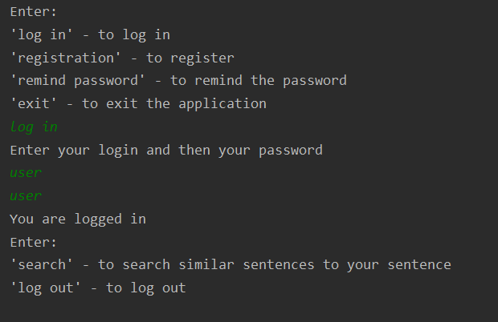

# Search-similar-sentences
Client-server application that uses dl4j to find sentences similar to the sentence entered by the client. 
The output sentences come from a collection of free books located on the server. 
The connection between the server and clients is encrypted by using the TLS protocol.
Logins and passwords of the users are stored in the xml file.

## Features
* Registering
* Logging in
* Reminding the password
* Searching 10 similar sentences to the entered sentence

## Preview
* Logging in

* Searching 10 similar sentences

